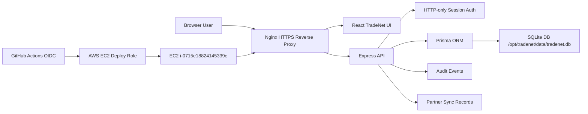

# Architecture Diagram

```mermaid
flowchart LR
  User["Browser User"] --> Nginx["Nginx HTTPS Reverse Proxy"]
  Nginx --> React["React TradeNet UI"]
  Nginx --> Api["Express API"]
  Api --> Auth["HTTP-only Session Auth"]
  Api --> Prisma["Prisma ORM"]
  Prisma --> SQLite["SQLite DB /opt/tradenet/data/tradenet.db"]
  Api --> Audit["Audit Events"]
  Api --> Partner["Partner Sync Records"]
  GitHub["GitHub Actions OIDC"] --> AWS["AWS EC2 Deploy Role"]
  AWS --> EC2["EC2 i-0715e18824145339e"]
  EC2 --> Nginx
```
