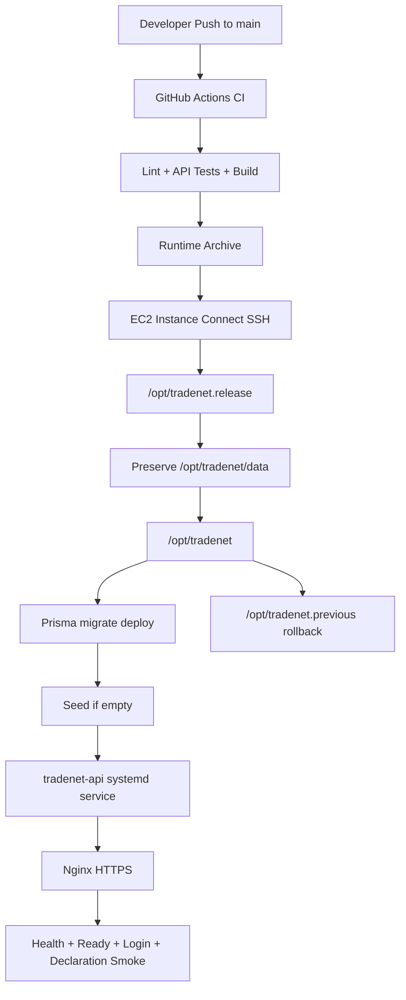

# Deployment Diagram

```mermaid
flowchart TB
  Dev["Developer Push to main"] --> CI["GitHub Actions CI"]
  CI --> Tests["Lint + API Tests + Build"]
  Tests --> Bundle["Runtime Archive"]
  Bundle --> EIC["EC2 Instance Connect SSH"]
  EIC --> Release["/opt/tradenet.release"]
  Release --> Preserve["Preserve /opt/tradenet/data"]
  Preserve --> Current["/opt/tradenet"]
  Current --> Migrate["Prisma migrate deploy"]
  Migrate --> Seed["Seed if empty"]
  Seed --> Systemd["tradenet-api systemd service"]
  Systemd --> Nginx["Nginx HTTPS"]
  Nginx --> Smoke["Health + Ready + Login + Declaration Smoke"]
  Current --> Backup["/opt/tradenet.previous rollback"]
```
